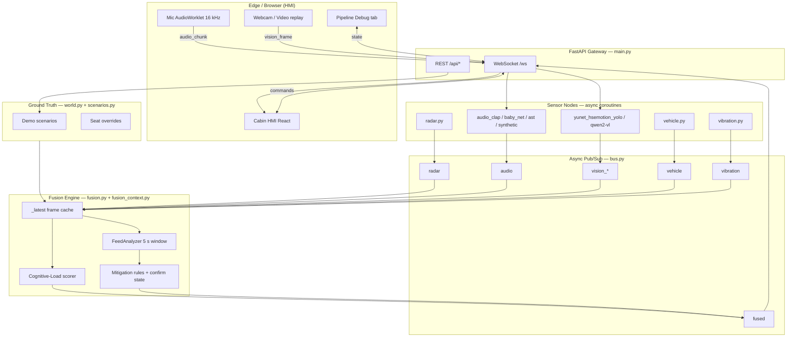
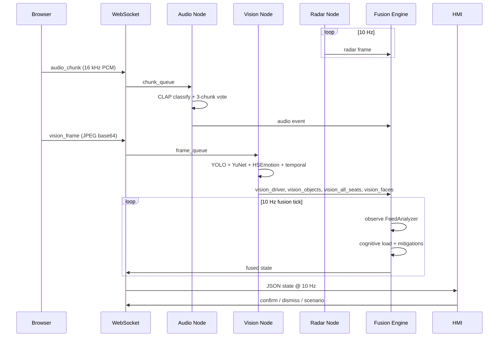
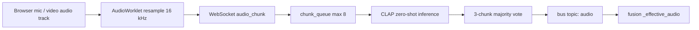
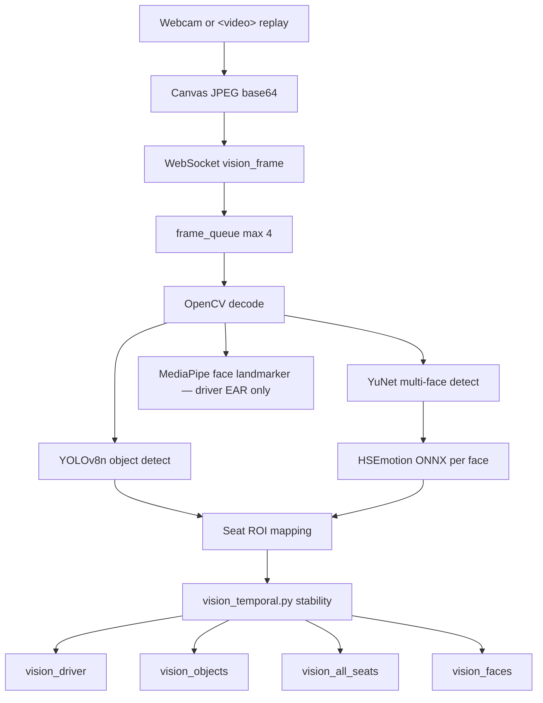
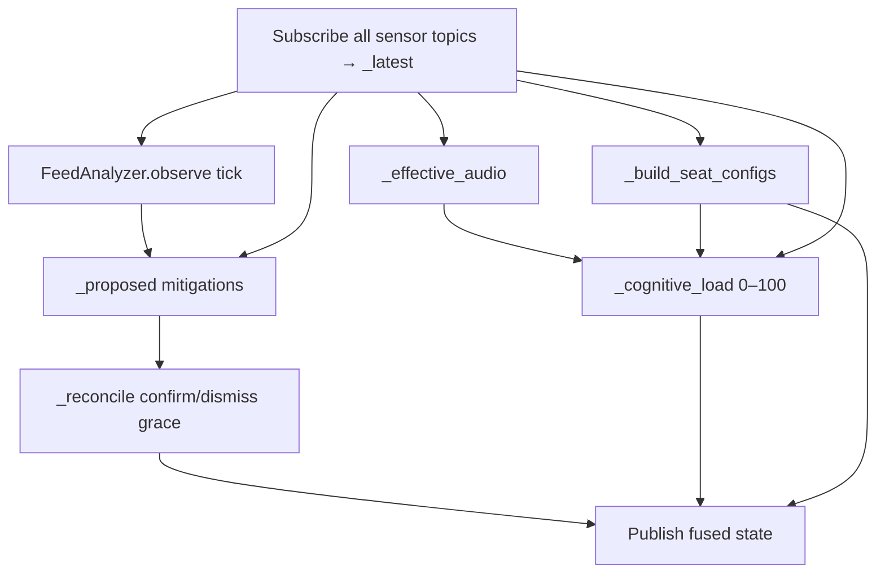
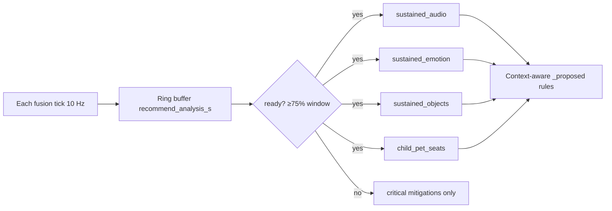
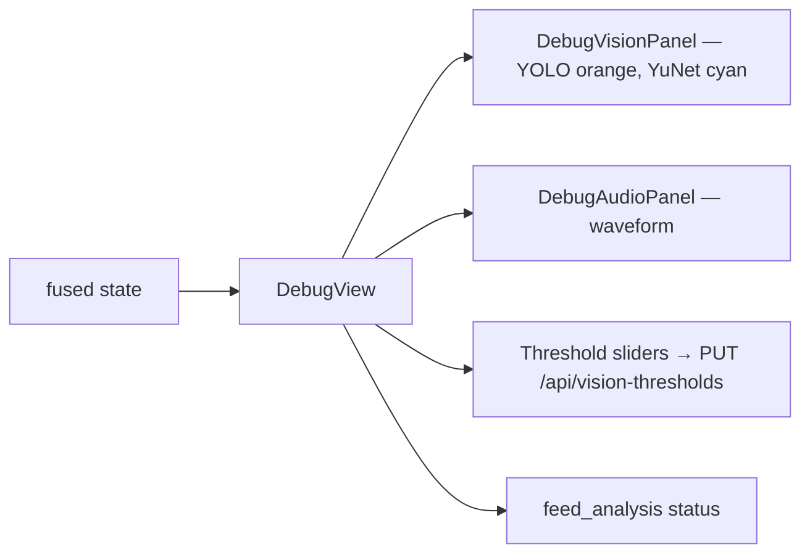

# CabinSense — System Architecture & Pipelines

> **In-cabin disturbance intelligence** — multi-modal sensing fused into a
> Cognitive-Load score and confirm-first mitigations.  
> One pipeline, many use cases: **sense → detect → fuse with context → adaptive feedback.**

This document is the canonical reference for data pipelines, message flows, and
component topology. For setup and day-to-day usage see [USAGE.md](USAGE.md).
For scoring rules and mitigation tables see [doc.md](doc.md).

---

## Table of Contents

1. [Layered Topology](#1-layered-topology)
2. [End-to-End Data Flow](#2-end-to-end-data-flow)
3. [Sensing Pipelines](#3-sensing-pipelines)
4. [Message Bus](#4-message-bus)
5. [Fusion & Decision Pipeline](#5-fusion--decision-pipeline)
6. [Context Analysis Pipeline](#6-context-analysis-pipeline)
7. [HMI & WebSocket Pipeline](#7-hmi--websocket-pipeline)
8. [Pipeline Debug & Observability](#8-pipeline-debug--observability)
9. [Control & Scenario Pipeline](#9-control--scenario-pipeline)
10. [Model Selection & Fallback Chains](#10-model-selection--fallback-chains)
11. [Configuration Surfaces](#11-configuration-surfaces)
12. [Temporal Processing](#12-temporal-processing)
13. [SDV / Production Mapping](#13-sdv--production-mapping)
14. [Repository Map](#14-repository-map)

---

## 1. Layered Topology



### Design principles

| Principle | Implementation |
|-----------|----------------|
| **Bounded latency** | Bus queues drop oldest on overflow; fusion target &lt; 200 ms |
| **Graceful degradation** | Each sensor node fails independently; fusion uses whatever is live |
| **Confirm-first** | Mitigations are *proposed*; driver taps Apply before any action |
| **Privacy** | Radar for vitals / child-left-behind; camera optional for emotion/objects |
| **SDV-aligned** | Pub/sub bus mirrors automotive signal topology; swap node bodies for hardware |

---

## 2. End-to-End Data Flow



**Typical latencies (CPU demo VM)**

| Stage | Rate | Notes |
|-------|------|-------|
| Radar / vehicle | 10 / 5 Hz | Synthetic from `world.py` |
| Audio publish | ~0.5 Hz | 2 s CLAP chunks + t+1 delay + smoothing |
| Vision publish | ~2–5 fps | Bounded by inference + `frame_queue` (max 4) |
| Fusion | 10 Hz | Measured &lt; 1 ms on CPU |
| WebSocket push | 10 Hz | One fused snapshot per tick |

---

## 3. Sensing Pipelines

### 3.1 Audio pipeline



| Step | Component | Detail |
|------|-----------|--------|
| Capture | `frontend/index.html` | `AudioWorklet`; chunk size from `/api/caps` (`audio_chunk_samples`, default 32000 = 2.0 s) |
| Transport | `main.py` `/ws` | `{cmd: "audio_chunk", data: [float…]}` |
| Queue | `audio_clap.chunk_queue` | Drops if full (non-blocking) |
| Inference | `sensors/audio_clap.py` | LAION CLAP-HTSAT; zero-shot prompts from `config.yaml` |
| Temporal | CLAP node | t+1 delay (`clap_delay_chunks`) + 3-chunk majority (`clap_smooth_chunks`) |
| Publish | `schemas.AudioEvent` | `label`, `confidence`, `distress_class`, `prompt` |
| Fusion resolve | `fusion._effective_audio()` | Classifier first; `world.audio_label` fallback |

**Fallback chain:** CLAP → BabyNet → AST/YAMNet → `sensors/audio.py` synthetic  
Selected at startup in `main.py`.

---

### 3.2 Vision pipeline (active: YuNet + HSEmotion + YOLO)



| Output topic | Payload | Consumer |
|--------------|---------|----------|
| `vision_driver` | `face_detected`, `emotion`, `drowsy`, EAR | Fusion driver persona, drowsy score |
| `vision_objects` | `detections[]` with `label`, `conf`, `bbox`, `seat` | Object mitigations, cognitive load |
| `vision_all_seats` | Per-seat `occupied`, `kind`, `emotion`, `objects[]` | Seat configs, child/pet corroboration |
| `vision_faces` | `faces[]` with bbox + emotion | Pipeline Debug overlay |

**Thresholds:** `config.yaml` → `vision.*`; runtime overrides via `PUT /api/vision-thresholds`.

**Fallback chain:** Qwen2-VL-2B (GPU or cached weights) → `yunet_hsemotion_yolo` (MediaPipe + YOLO) → none.

---

### 3.3 Radar pipeline

```
world.seats + scenario state
        │
        ▼
  radar.py (10 Hz)
        │
        ▼
  bus "radar"  →  RadarFrame { seats[], point_count, vitals }
        │
        ▼
  fusion: driver HR/resp, child-left-behind, seatbelt checks
```

Synthetic mmWave for hackathon; publishes occupancy, buckled, HR, respiration, micro-motion per seat.

---

### 3.4 Vehicle context pipeline

```
world.speed_kmh, visibility, pothole_ahead_m
        │
        ▼
  vehicle.py (5 Hz)  →  bus "vehicle"
        │
        ▼
  fusion: speed/visibility scoring, pothole + object advisory
```

---

### 3.5 Vibration / IMU pipeline

```
world.vib_*  OR  data/route_imu.csv replay
        │
        ▼
  vibration.py (50 Hz)  →  bus "vibration"
        │
        ▼
  fusion: rough road / pothole cognitive-load factors
```

---

## 4. Message Bus

**Implementation:** `backend/bus.py` — topic-keyed `asyncio.Queue` lists; publish drops oldest when full.

### Topic contract

| Topic | Publisher | Rate | Key fields |
|-------|-----------|------|------------|
| `radar` | `radar.py` | 10 Hz | `seats[]`, `point_count` |
| `audio` | audio node | ~0.5 Hz | `label`, `confidence`, `distress_class`, `prompt` |
| `vehicle` | `vehicle.py` | 5 Hz | `speed_kmh`, `pothole_ahead_m`, `visibility` |
| `vibration` | `vibration.py` | 50 Hz | `rms`, `road_quality`, `pothole_ahead_m` |
| `vision_driver` | vision node | 2–5 fps | `face_detected`, `emotion`, `drowsy` |
| `vision_objects` | vision node | 2–5 fps | `detections[]` |
| `vision_all_seats` | vision node | 2–5 fps | per-seat occupancy / emotion / objects |
| `vision_faces` | vision node | 2–5 fps | `faces[]` for debug overlay |
| `fused` | `fusion.py` | 10 Hz | full HMI state (see below) |

Schemas documented in `backend/schemas.py`; wire format is plain `dict`.

---

## 5. Fusion & Decision Pipeline



### Per-tick outputs (`bus "fused"`)

| Field | Description |
|-------|-------------|
| `cognitive_load` | 0–100 attention-risk score |
| `factors` | Human-readable contributing factors |
| `mitigations` | Cards: `id`, `title`, `detail`, `severity`, `status`, `confirm` |
| `seat_configs` | Merged world + radar + vision per seat |
| `feed_analysis` | Context window status (see §6) |
| `audio_effective` | Label fusion actually uses |
| `vision_*` | Latest vision frames passthrough |
| `latency_ms` | Fusion tick duration |

### Mitigation lifecycle

```
_proposed()  →  status: "proposed" (confirm=true) or "active" (critical)
     │
     ├─ HMI "Apply"  →  confirm(id)  →  status: "active"
     └─ HMI "Dismiss" →  dismiss(id)  →  status: "dismissed"
     
_reconcile() keeps dismissed/confirmed cards for grace_period_s (6 s default)
after triggering condition clears.
```

**Safety-critical** (seatbelt, child-left-behind) bypass the context warm-up window.

---

## 6. Context Analysis Pipeline

**Module:** `backend/fusion_context.py` — `FeedAnalyzer`

After ~5 seconds of sustained feed, recommendations combine **audio + objects + emotions** instead of reacting to single frames.



### Tick payload (observed each fusion cycle)

```python
{
  "audio_label": str,
  "audio_conf": float,
  "seats": { seat_id: { occupied, kind, emotion } },
  "objects_by_seat": { seat_id: [object_labels] },
  "driver_drowsy": bool,
}
```

### Sustained-signal queries

| Method | Use |
|--------|-----|
| `sustained_audio(*labels)` | CLAP label in ≥45% of window ticks |
| `sustained_emotion(seat, *emotions)` | HSEmotion stable on a seat |
| `seats_with_sustained_emotion(...)` | Rear comfort checks |
| `sustained_objects()` | YOLO objects stable per seat |
| `sustained_drowsy()` | Driver drowsy across window |
| `child_pet_seats()` | Sustained child/pet occupancy |
| `snapshot()` | Exposed as `feed_analysis` on WebSocket |

**Reset triggers:** scenario change, `reset_vision` command, `fusion.reset_vision()`.

**Tuning:** `config.yaml` → `fusion.recommend_analysis_s`, `fusion.recommend_min_ratio`.

### Example multimodal rules (post warm-up)

| Sustained signals | Mitigation |
|-------------------|------------|
| crying + child seat + distressed face | Soothe cabin (audio + vision) |
| rattle + stable bottle on seat | Secure item (audio + object) |
| stressed rear face, no loud audio | Passenger comfort check |
| stable YOLO object + pothole ahead | Pre-emptive secure advisory |

---

## 7. HMI & WebSocket Pipeline

```mermaid
flowchart TB
  subgraph IN["Browser → Server"]
    C1[scenario]
    C2[configure_seat]
    C3[configure_vehicle]
    C4[configure_vibration]
    C5[confirm / dismiss]
    C6[audio_chunk]
    C7[vision_frame]
    C8[reset_vision]
  end

  subgraph OUT["Server → Browser"]
    PUMP[pump fused @ 10 Hz]
  end

  IN --> main.py
  main.py --> nodes & fusion & scenarios
  fusion --> PUMP --> React state
```

### HMI views (`frontend/index.html`)

| Tab | Purpose |
|-----|---------|
| **Sensor Simulation & Replay** | Cabin map, gauge, mitigations, live mic/cam/video |
| **Infotainment View** | Driver-facing simplified layout |
| **Pipeline Debug** | Model status, waveforms, bbox overlays, thresholds |

State is a single React `useState` updated from WebSocket JSON — no build step (CDN/bundled React).

---

## 8. Pipeline Debug & Observability

The **Pipeline Debug** tab is a live observability layer on top of the same WebSocket stream.



| REST endpoint | Purpose |
|---------------|---------|
| `GET /api/caps` | Active audio/vision nodes, chunk size, model readiness |
| `GET /api/vision-thresholds` | Current YOLO/emotion/temporal thresholds |
| `PUT /api/vision-thresholds` | Live threshold tuning from debug UI |
| `GET /api/scenarios` | Scenario list + current |
| `GET /api/videos` | Files in `backend/video/` |

---

## 9. Control & Scenario Pipeline

```
User clicks scenario  OR  demo auto-play  OR  seat config overlay
        │
        ▼
  scenarios.apply(name)  →  mutates world.py ground truth
        │
        ├── radar / vehicle / vibration read world on next tick
        ├── fusion resets FeedAnalyzer on scenario change
        └── WebSocket broadcasts new fused state
```

**Demo script** (`main.py` `DEMO_SCRIPT`): idle → crying → stress → tired → seatbelt → pothole → child-left → idle with auto-confirm on selected mitigations.

**Manual overrides:** `configure_seat` writes `world.seat_overrides` so vision does not clobber user-configured seats.

---

## 10. Model Selection & Fallback Chains

### Audio (startup probe in `main.py`)

```
1. sensors/audio_clap.py     →  clap_zs      (preferred)
2. sensors/baby_net.py       →  baby_net
3. sensors/audio_yamnet.py   →  ast
4. sensors/audio.py          →  synthetic
```

### Vision (startup probe in `_init_vision_sync`)

```
1. sensors/qwen_vision.py    →  qwen2-vl-2b  (CUDA or local weights)
2. sensors/vision.py         →  yunet_hsemotion_yolo
3. none                      →  vision_ready: false
```

Status exposed via `GET /api/caps`: `audio_node`, `vision_node`, `yolo_ready`, `emotion_ready`, `vision_device`.

---

## 11. Configuration Surfaces

| File / API | Controls |
|------------|----------|
| `backend/config.yaml` | Fusion scoring weights, CLAP prompts, vision ROIs, temporal windows, recommendation window |
| `backend/config.py` | Typed accessors loaded at import |
| `PUT /api/vision-thresholds` | Runtime vision thresholds (not persisted across restart) |
| `backend/data/ui_layout.json` | HMI panel positions (`GET/PUT /api/ui-layout`) |
| `world.seat_overrides` | Per-seat manual config via WebSocket |

**No code changes needed** for most threshold tuning — edit `config.yaml` and restart the server.

---

## 12. Temporal Processing

Smoothing happens at three layers:

| Layer | Module | What is stabilized |
|-------|--------|----------------------|
| **Audio** | `audio_clap.py` | 3-chunk majority vote + t+1 delay |
| **Vision** | `vision_temporal.py` | YOLO objects, seat occupancy, drowsy flag |
| **Emotion** | `face_emotion.py` | HSEmotion per-face rolling window |
| **Recommendations** | `fusion_context.py` | 5 s sustained-signal ratios before proposing comfort mitigations |

Default vision temporal settings (`config.yaml`):

```yaml
temporal_window_frames: 3
temporal_min_hits: 2
temporal_clear_misses: 2
emotion_smooth_frames: 3
```

---

## 13. SDV / Production Mapping

The hackathon software topology maps directly onto a software-defined vehicle:

```
┌──────────────────┐     ┌──────────────────┐     ┌──────────────────┐
│  Sensor ECU /    │     │  Zone controller │     │  Cabin HMI /       │
│  edge node       │────▶│  message bus     │────▶│  IVI application │
│  (radar, mic,    │     │  (DDS / SOME/IP) │     │  (confirm-first) │
│   cam, IMU)      │     │                  │     │                  │
└──────────────────┘     └──────────────────┘     └──────────────────┘
     sensors/*.py              bus.py                  frontend/
```

To go to production hardware: **replace only the node body** inside each `sensors/*.py` file; keep `schemas.py` contracts and bus topic names.

---

## 14. Repository Map

```
in-cabin-hackthon/
├── ARCHITECTURE.md          ← this document
├── USAGE.md                 ← setup & operator guide
├── doc.md                   ← scoring formulas & mitigation reference
├── VideoPanel.md            ← video replay integration notes
├── CLAUDE.md                ← hackathon plan & conventions
│
├── backend/
│   ├── main.py              ← FastAPI, WebSocket, node orchestration
│   ├── bus.py               ← async pub/sub
│   ├── schemas.py           ← wire contracts
│   ├── world.py             ← shared cabin ground truth
│   ├── scenarios.py         ← demo scenario mutations
│   ├── fusion.py            ← cognitive load + mitigations
│   ├── fusion_context.py    ← 5 s context analysis
│   ├── config.yaml          ← tunable thresholds
│   ├── sensors/
│   │   ├── radar.py
│   │   ├── audio_clap.py    ← primary audio
│   │   ├── vision.py        ← YuNet + HSEmotion + YOLO
│   │   ├── face_emotion.py
│   │   ├── vision_temporal.py
│   │   ├── vision_runtime.py
│   │   ├── vehicle.py
│   │   └── vibration.py
│   ├── video/               ← demo replay files
│   └── models/              ← downloaded weights
│
└── frontend/
    ├── index.html           ← HMI + Pipeline Debug (React)
    └── deck.html            ← pitch deck
```

---

## Quick reference diagram (documentation / pitch)

```
 SENSING NODES          MESSAGE BUS           FUSION ENGINE           HMI
 ─────────────          ───────────           ─────────────           ───
 Radar (mmWave)  ─┐
 Mic → CLAP      ─┤
 Cam → YOLO      ─┼── topics ──▶  _latest + FeedAnalyzer  ──▶  WebSocket
                 ─┤              → Cognitive-Load score         Cabin dashboard
 IMU → CSV       ─┤              → Context mitigations          Pipeline Debug
 Vehicle/GPS     ─┘              → confirm-first state          Infotainment
```

*CabinSense — June 2026 hackathon build.*
